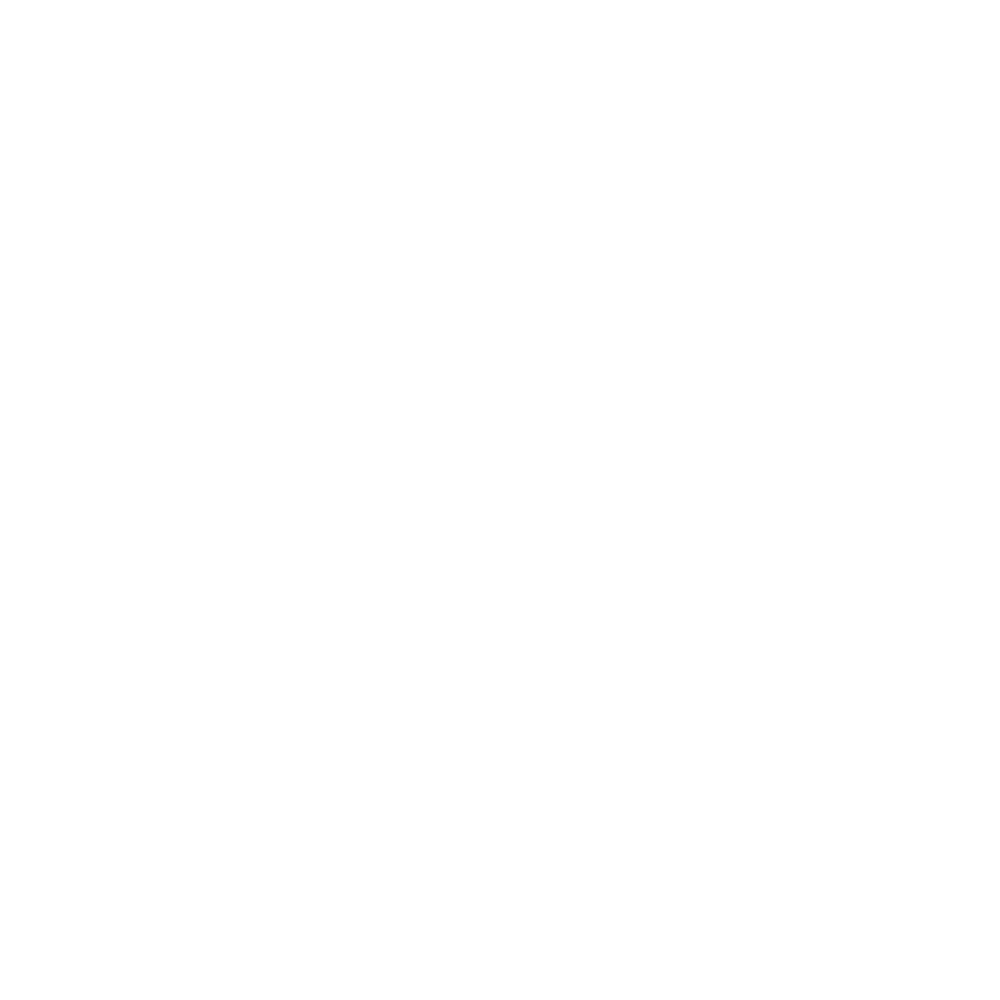

# Kartodromo di Casaluce

[](https://github.com/KinG-InFeT/blender-assetto-corsa-track-generator)


[](LICENSE)
[](https://assetto-corsa-mods.luongovincenzo.it/casaluce)

<p align="center">
  
</p>

Circuito kart a Casaluce (CE), Campania. ~1000 m, larghezza 6 m, layout CW + reverse CCW.
Pista asfaltata con illuminazione notturna. Kart, minimoto, supermotard, pitbike.

Layout editor con snap cordoli ai bordi strada e visualizzazione larghezza pista.
Muri con base Z ancorata al profilo del terreno.

Record: **0:37.974** (Gianluigi)

## Requisiti

- Python 3.10+, Blender 5.0+, Assetto Corsa (Steam)
- [blender-assetto-corsa-track-generator](../blender-assetto-corsa-track-generator/) clonato nella stessa cartella parent

## Setup

```bash
python3 -m venv .venv
source .venv/bin/activate
pip install -r ../blender-assetto-corsa-track-generator/requirements.txt
```

## Build e installazione

```bash
cd ../blender-assetto-corsa-track-generator

# Build
TRACK_ROOT=/path/to/casaluce-track python3 build_cli.py

# Build + install in AC
TRACK_ROOT=/path/to/casaluce-track python3 build_cli.py --install

# Solo install (senza rebuild)
TRACK_ROOT=/path/to/casaluce-track python3 install.py
```

## GUI Manager

```bash
cd ../blender-assetto-corsa-track-generator
source ../casaluce-track/.venv/bin/activate
python3 manager.py
```

## Struttura

```
casaluce.blend        Sorgente Blender
centerline.json       Dati layout v2 (road, cordoli, muri, start, map_center)
track_config.json     Configurazione pista
textures/             Texture (asphalt, curb, grass, barrier, startline, sponsor1)
cover.png             Copertina mod
```

## Parametri

| Parametro | Valore |
|-----------|--------|
| Lunghezza | ~1000 m |
| Larghezza | 6.0 m |
| Pit boxes | 5 |
| Layouts | CW + CCW |
| Elementi extra | Gantry startline (portale con pannello sponsor + 5 luci rosse) |
| GPS | 41.0072, 14.1892 |
